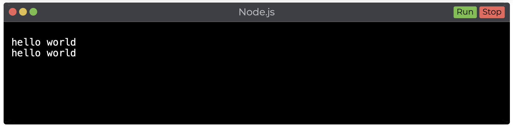

# spectacle-output-terminal

Spectacle Output Terminal is a [Spectacle](https://formidable.com/open-source/spectacle/) component for rendering a output terminal into your slide deck.



## Installation

To install simply run:

```shell
npm i spectacle-output-terminal
```

Then to import the extension add the following.

```javascript
import Terminal from 'spectacle-output-terminal';
```

## License

Copyright (c) 2020 Jonathan Fielding. MIT Licensed.
